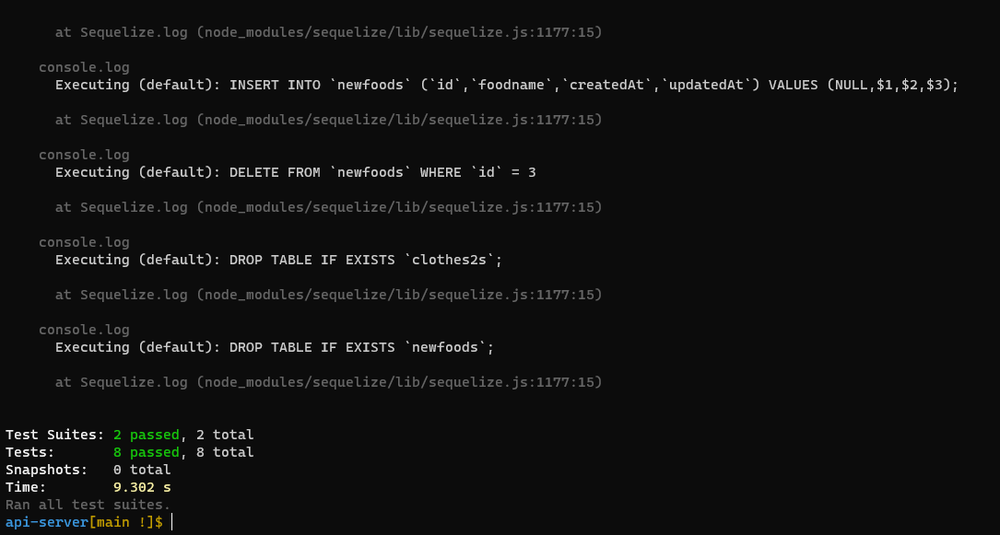

# api-server

**Auther: Aseel Alasaad**

[PR](https://github.com/AseelAlasaad/api-server/pull/3)

[Action](https://github.com/AseelAlasaad/api-server/actions)

[heroku path food main](https://api-server-main.herokuapp.com/food)

[heroku path  clothes main](https://api-server-main.herokuapp.com/clothes)

[heroku path food dev](https://api-serverdev.herokuapp.com/food)

[heroku path  clothes dev](https://api-serverdev.herokuapp.com/clothes)

# uml

note:

create database  and tow table one for food and another one for clothes
create relation between table one to many.

# test

