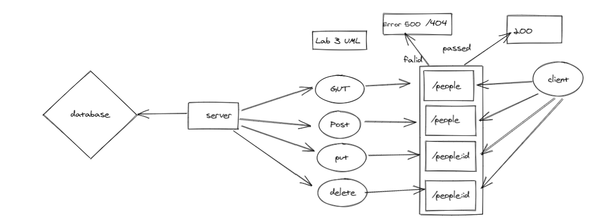

# api-server

[PR](https://github.com/AseelAlasaad/api-server/pull/1)

[Action](https://github.com/AseelAlasaad/api-server/actions)

# uml

note:

create database called peopledb and tow table one for people and another one for address 
create relation between table one to many 

